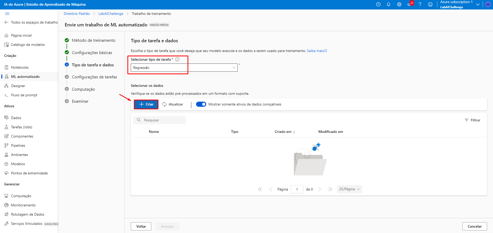

## Machine Learning on Azure ML [:us: Video Tutorial](https://www.youtube.com/watch?v=p7zSlx5j-e4&t=45s) | [:brazil: Video Tutorial](https://www.youtube.com/watch?v=scEeK9juXOQ) | [🇪🇸 Video Tutorial](https://www.youtube.com/watch?v=PbmIYPwWtP8&t=3s)

  

   
  

> Project developed as a challenge - AI-900 Preparation!

## About the project

My first project on Azure Machine Learning, in which, using regression, I trained a model with more than 6000 different games to make assumptions or predict global video game sales, as well as to generate a dashboard with various insights.
  
## **Step-by-step**

### **Step one**

First, I created a new workspace in Azure Machine Learning, as well as creating a new resource group and choosing a name for my project. Then, I simply left the rest as default and clicked on "create", and then waited about 5 minutes for the successful creation of my workspace.

### **Step two**

I initiated the studio as you can see in the photo, I chose the "Automated ML" option and created a new automated ML job. Next, I put in a name I thought was suitable for my project, a name for my experiment, and a description. After that, I chose to perform regression because I wanted to predict a numerical value. I selected "Tabular" as the data asset type, imported a .csv file that I wanted to experiment with, and processed the data to see if it was in the correct format. Finally, I chose the primary metric "NormalizedRootMeanSquaredError" and allowed the "RandomForest" and "LightGBM" models, setting in the limits tab the respective values of: 3, 3, 3, 0.085, 15, 15, and enabling early termination, in addition to choosing the validation option called "Training validation split".

### **Step three**

aaaa

### Step 2

## 👨‍💼 Autor

<table>
  <tr>
    <td align="center">
      <a href="#">
         
        
          <b>Gian Dutra</b>
        
      </a>
    </td>
  </tr>
</table>
